# 自定义View
Android自定义View-会动的鱼 

## 效果截图 

  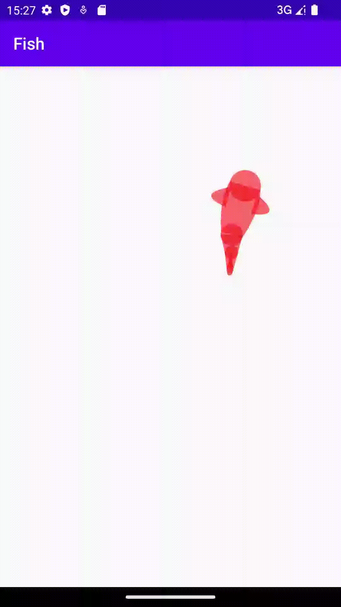

实现步骤:
1. 实现小鱼的绘制
2. 实现小鱼的原地摆动 
3. 实现小鱼点击游动

## 分解图

  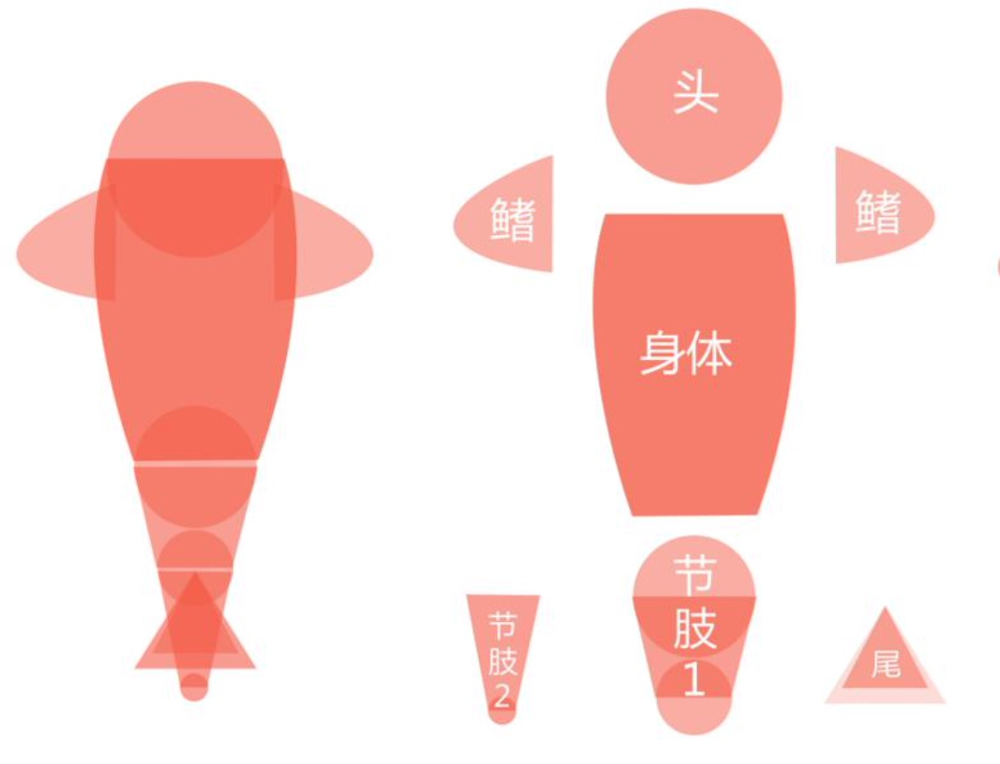

## Drawable
Drawable是什么?
1. 一种可以在Canvas上进行绘制的抽象的概念
2. 颜色、图片等都可以是一个Drawable
3. Drawable可以通过XML定义，或者通过代码创建
4. Android中Drawable是一个抽象类，每个具体的Drawable都是其子类

Drawable的优点:
1. 使用简单，比自定义View成本低
2. 非图片类的Drawable所占空间小，能减小apk大小

## Drawable 方法重写

  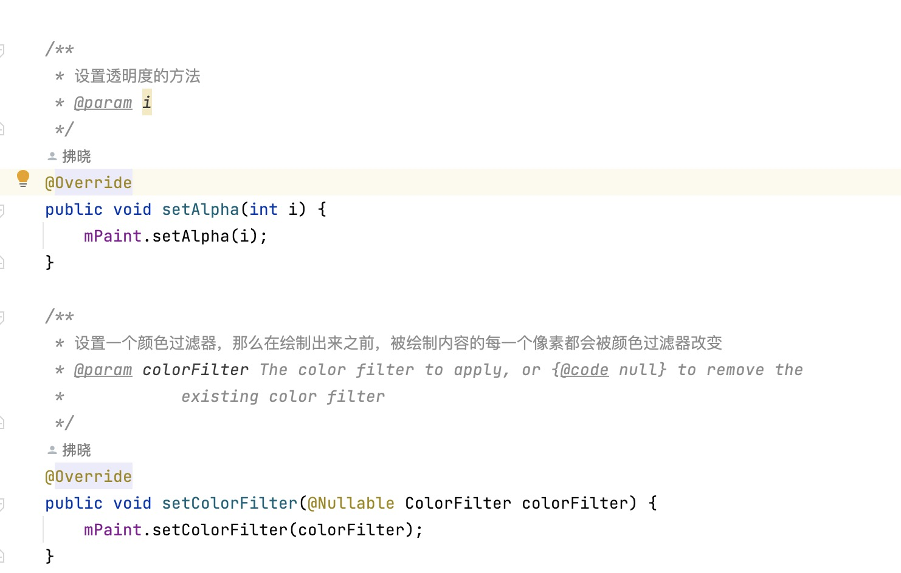

  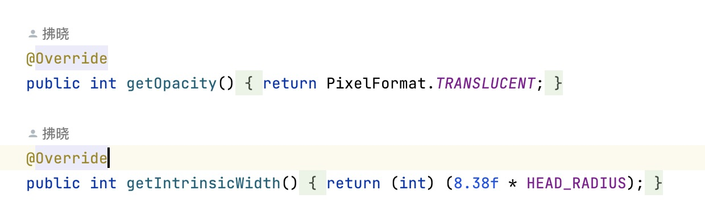

## Paint
        //画笔
        mPaint = new Paint();
        //抗锯齿
        mPaint.setStyle(Paint.Style.FILL);
        //画笔类型填充
        mPaint.setAntiAlias(true);
        //防抖
        mPaint.setDither(true);
        //设置颜色
        mPaint.setARGB(OTHER_ALPHA, 244, 10, 22);

## Paint
Path封装了由直线和曲线(二次，三次贝塞尔曲线)构成的几何路径。你能用Canvas中的drawPath 来把这条路径画出来(同样支持Paint的不同绘制模式)，也可以用于剪裁画布和根据路径绘制文字。

  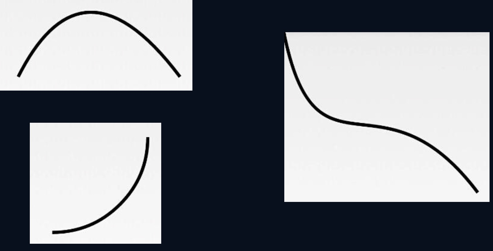

注意:用drawPath绘制了后，Path的路径还是存在的，所以如果需要绘制新的路径，需要先调用Path的reset方法。

## Paint
Canvas 在一般的情况下可以看作是一张画布，所有的绘图操作如drawBitmap, drawCircle都发生在这张画布上， 这张画板还定义了一些属性比如Matrix，颜色等等。但是如果需要实现一些相对复杂的绘图操作，比如多层 动画，地图(地图可以有多个地图层叠加而成，比如:政区层，道路层，兴趣点层)。Canvas提供了图层 (Layer)支持，缺省情况可以看作是只有一个图层Layer。如果需要按层次来绘图，Android的Canvas可以使 用saveLayerXXX, restore 来创建一些中间层，对于这些Layer是按照“栈结构“来管理的:

  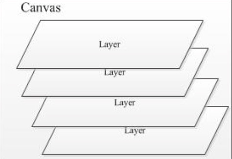

创建一个新的Layer到“栈”中，可以使用saveLayer, savaLayerAlpha, 从“栈”中推出一个Layer，可以使用 restore,restoreToCount。当Layer入栈时，后续的DrawXXX操作都发生在这个 Layer上，而Layer退栈时，就会把 本层绘制的图像“绘制”到上层或是Canvas上。

## 计算宽高

  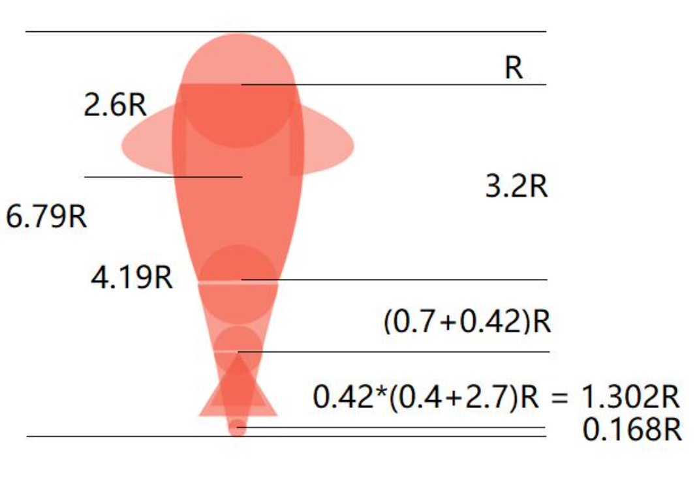

## 计算坐标
1. sinA=a/c-->sinA*c=a-->得到B点的y坐标 2. cosA=b/c-->cosA*c=b-->得到B点的x坐标 3. Math.sin()、Math.cos()的参数是弧度。坐标是
按数学中的坐标。
4. Math.toRadians() 将角度转成弧度。
5. 圆是360度，也是2π弧度，即360°=2π

  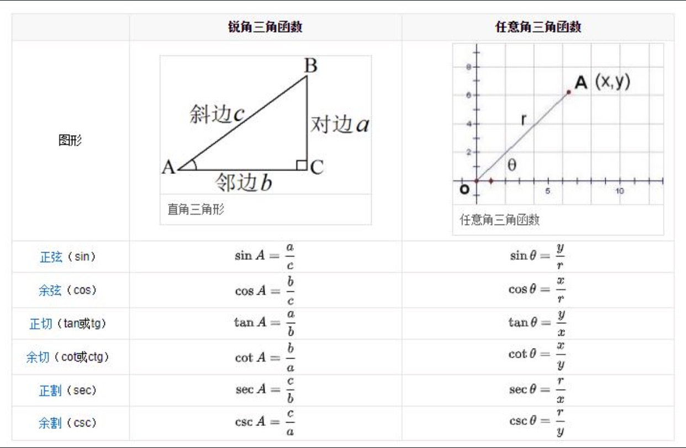

## 坐标计算方式

  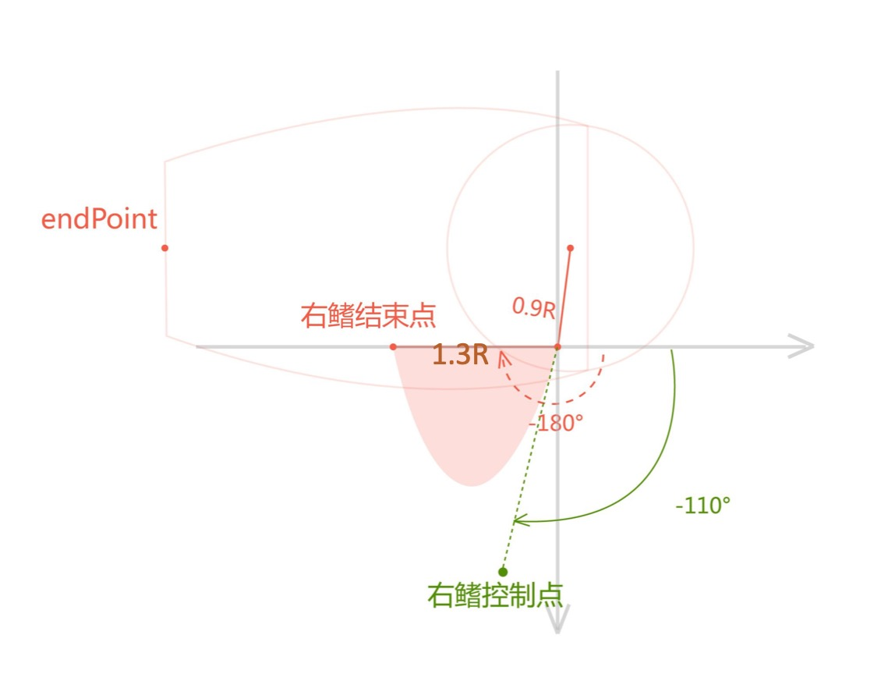

## 属性动画
1. ValueAnimator 没有重绘，所以需要自己调用addUpdateListener方法， 需要结合AnimatorUpdateListener使用。
2. 操作的对象的属性不一定要有getter和setter方法。 
3. 默认插值器为AccelerateDecelerateInterpolator

        // 1.2  1.5 ==》 10
        // 1.2*n = 整数 1.5 *n = 整数 ==》 公倍数
        ValueAnimator valueAnimator = ValueAnimator.ofFloat(0, 3600f);
        // 动画周期
        valueAnimator.setDuration(15 * 1000);
        // 重复的模式：重新开始
        valueAnimator.setRepeatMode(ValueAnimator.RESTART);
        // 重复的次数
        valueAnimator.setRepeatCount(ValueAnimator.INFINITE);
        // 插值器
        valueAnimator.setInterpolator(new LinearInterpolator());
        valueAnimator.addUpdateListener(new ValueAnimator.AnimatorUpdateListener() {
            @Override
            public void onAnimationUpdate(ValueAnimator animator) {
                currentValue = (float) animator.getAnimatedValue();
                invalidateSelf();
            }
        });
        valueAnimator.start();

继承自ValueAnimator，相对于ValueAnimatior，可以直接操作控件。
原理:通过改变 View 的属性值来改变控件的形态，说白了就是通过反射技术来获取控件的一些属性如 alpha、scaleY等的 get 和 set 方法，从而实现所谓的动画效果。所以，这就需要我们的 View (如自定义 View 中)具有 set 和 get 方法，如果没有则会导致程序的 Clash 。
具体步骤:
1. 首先，系统通过get方法获得属性值
2. 系统在时间插值器的作用下，变更属性值 
3. 系统调用set方法，将属性值重新赋予控件
// 透明度动画 --- 需要有setAlpha,getAlpha方法 ObjectAnimator.ofFloat(ivFish, "alpha", 1, 0, 1).setDuration(4000) .start();

## 鱼游的路线

  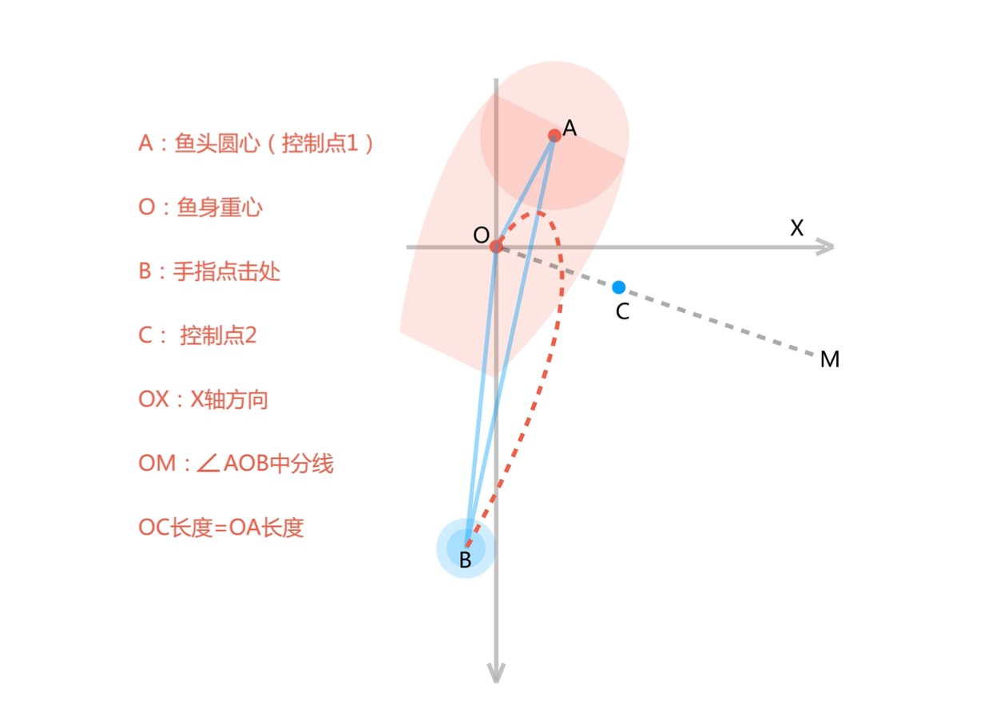

1. 利用头部圆心、鱼身的重心以及点击点坐标来唯一确定一个特征三角形。
2. 确定鱼身需要向左还是向右转弯，知道三角形内角AOB的大小，就知道转动的方向了。

## 向量夹角计算
向量的夹角公式计算夹角cosAOB = (OA*OB)/(|OA|*|OB|)其中OA*OB是向量的数量积, 计算过程如下:

OA=(Ax-Ox,Ay-Oy)
OB=(Bx-Ox,By-Oy) 
OA*OB=(Ax-Ox)(Bx-Ox)+(Ay-Oy)*(By-Oy) 
|OA|表示线段OA的模即OA的长度

## 三角函数

  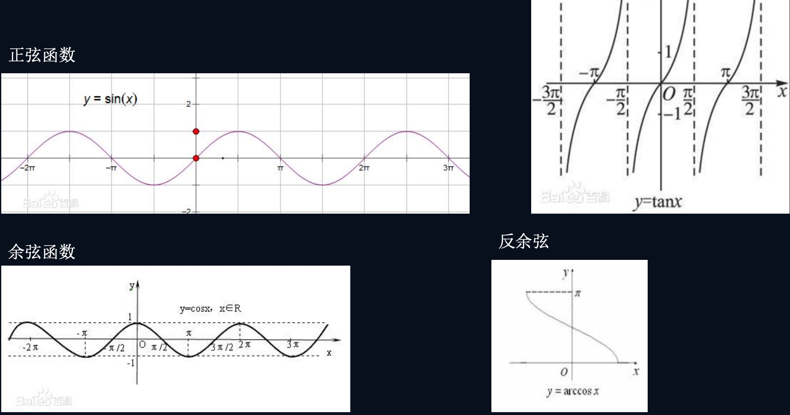

  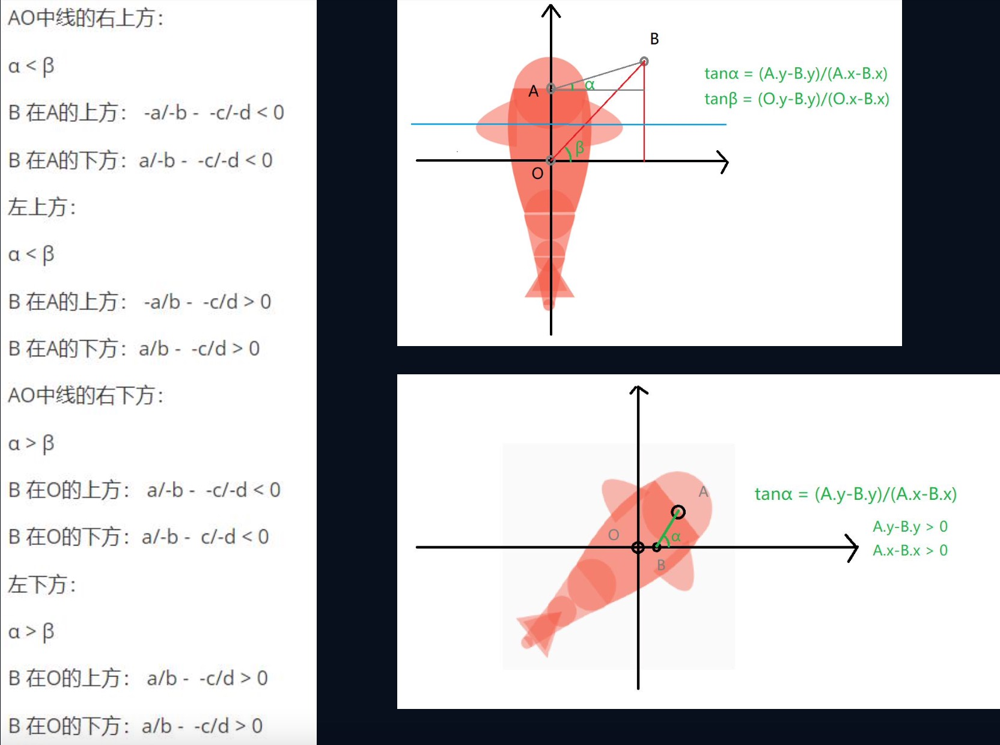

## PathMeasure
mPathMeasure.getPosTan(float distance, float pos[], float tan[])，参数信息:
distance : 这个参数就是确定要获取路径上哪个位置的点
pos[] :根据distance返回点的坐标信息并保存在传入的pos[]内， X保存在 pos[0], Y则在pos[1]
tan[] :根据distance返回点的角度信息并保存传入tan[]内，主要结合float degree = (float) (Math.atan2(mTan[1], mTan[0]) * 180 / Math.PI);